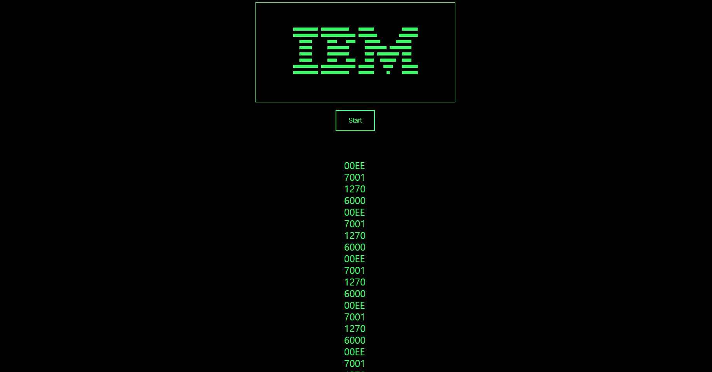

# CHIP-8 emulator in Rust, WebAssembly
  

CHIP-8 emulator from scratch, built with rust and wasm-pack. 

> [CHIP-8](https://en.wikipedia.org/wiki/CHIP-8) is an interpreted programming language, developed by Joseph Weisbecker made on his 1802 Microprocessor. It was initially used on the COSMAC VIP and Telmac 1800 8-bit microcomputers in the mid-1970s.

## Build

### 0. Setup
[Install wasm-pack](https://developer.mozilla.org/en-US/docs/WebAssembly/Rust_to_wasm#wasm-pack). 

`cargo install wasm-pack`

### 1. Build WASM package

`wasm-pack build --debug --target web`


### 2. Serve index.html

Open index.html in any browser which supports wasm.
Static files in pkg directory should be fetched from browser.

For example, run simple http server and open index.html in browser.
```
python3 -m http.server 9000
```


## Key Descriptions
### Core Rust code

```rust
#[wasm_bindgen]
#[derive(Serialize, Deserialize)]
pub struct CPU {
    position_in_memory: usize,
    index_register: u16,
    registers: [u8; 16],
    ...
}

#[wasm_bindgen]
impl CPU {
    #[wasm_bindgen(constructor)]
    pub fn new() -> Self {
        let mut _cpu = CPU {
            registers: [0; 16],
            memory: [0; 4096],
            position_in_memory: 0x200,
            ...
        };

```
Core implementations can be found in `src/cpu.rs`. CPU struct and key public functions are exported to Javascript by `wasm_bindgen` macro.

Opcodes are read and executed by `run_cycle` function, starting from position_in_memory.

```rust
pub fn run_cycle(&mut self) {
        let opcode = self.read_opcode();

        self.position_in_memory += 2;

        let c = ((opcode & 0xF000) >> 12) as u8;
        ...

        match (c, x, y, d) {
            (0, 0, 0, 0) => {
                return;
            }
            (0, 0, 0xE, 0) => self.clear_display(),
            (0, 0, 0xE, 0xE) => self.ret(),
            (1, _, _, _) => self.jump(nnn),
            (0x2, _, _, _) => self.call(nnn),
            ...
        }
    }
}
```

Keypad is separately defined in `src/keypad.rs`.

### Using WASM pkg in html

```html 
<script type="module">
    import init, { CPU } from "./pkg/chip_8_emulator_rust.js";

    async function init_emulator() {
            await init();
            let cpu = new CPU();
    ...

</script>
```

WASM pkg can be imported from Javascript as above. Exported structs and functions can be used in Javascript like `let cpu = new CPU();`. 

However, since `init` function is async function, using exported objects should be called after `init` function is executed completely. This can be achieved by declaring async function as wrapper, and use await keyword for `init` function.


## Limitations
* Roms such as Space Invaders, Tetris are not tested.
* `FX0A waitKey` is not correctly implemented. This blocks running some roms which requires running `FX0A` opcode. 
* Sounds are not implemented.

## References
* [CHIP-8 Specification](http://www.cs.columbia.edu/~sedwards/classes/2016/4840-spring/designs/Chip8.pdf) : Columbia University, Embedded Systems 4840

* [CHIP-8 Testsuite Rom](https://github.com/Timendus/chip8-test-suite) : Great ROM for testing opcodes while implementing CHIP-8 emulator from scratch.

* [Rust in Action](https://www.amazon.com/Rust-Action-TS-McNamara/dp/1617294551) : 'Chapter6, Memory' is a good place to start.

## License

This code is free for you to use under the MIT licence.